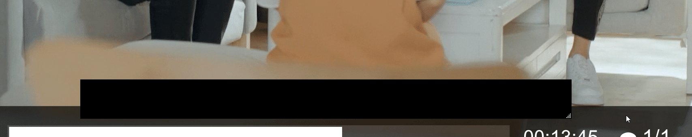

# [Download (Windows)](https://github.com/xCaoCao/SubtitleHider/releases/download/0.2/SubtitleHider.exe)
# [Download (Windows) transparent/blurry](https://github.com/xCaoCao/SubtitleHider/releases/download/0.4/SubtitleHiderUWP_1.0.4.0.zip)
For installing the blurry version please right click "Add-AppDevPackage.ps1" and run with powershell. [App sideloading](https://www.windowscentral.com/how-enable-windows-10-sideload-apps-outside-store) must be enabled.

Requires [.net Framework v4.7.2](http://go.microsoft.com/fwlink/?LinkId=863262)

# [Download (macOS)](https://github.com/xCaoCao/SubtitleHider/releases/download/0.2/subtitle-hider-1.0.0-install.dmg)
Credit for the Mac version goes to [imron](https://github.com/imron)

